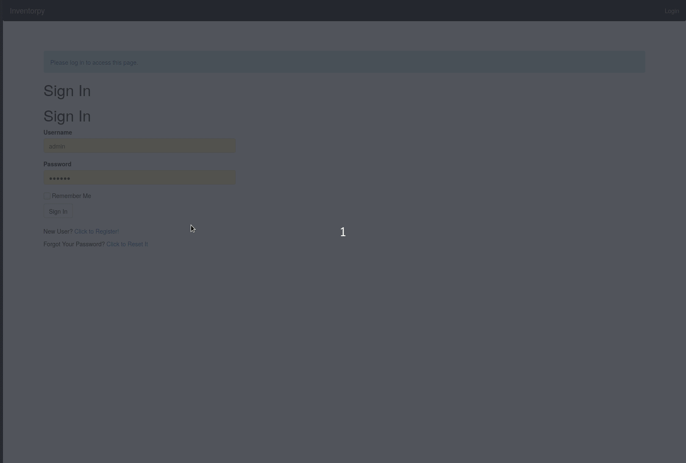

# About

Inventory management (or cmdb) service for multiple teams.

Also can announce new/changes to Rocket.Chat

REST API for automatic management is on the agenda but not finished

Very early version but working software.

Author: https://github.com/henrik-andreasson/

Heavily based on the excellent tutorial  [Flask Mega Tutorial](https://blog.miguelgrinberg.com/post/the-flask-mega-tutorial-part-i-hello-world) by Miguel Grinberg.

Big Thanks to Miguel!

# demo

login with:

    user: admin
    pass: foo123

[inventorpy demo](https://inventorpydemo-hlvrh7b52a-lz.a.run.app/)

# Running

## Running on CentOS

Install python3 and sqlite

    yum install -y python3 sqlite

Used modules

    pip3 install flask-sqlalchemy flask-migrate flask-login flask-mail \
      flask-bootstrap flask-moment flask-babel jwt flask-wtf \
      WTForms-Components flask-httpauth rocketchat_API

install source

    mkdir /opt/inventorpy
    cd /opt/inventorpy
    unzip inventorpy-x.y.z.zip

start

    export FLASK_APP=inventorpy.py
    cd /opt/inventorpy
    flask run --host=0.0.0.0

See also the systemd service file inventorpy.service to run with gunicorn

## Running in Docker

build docker:

    docker build -t inventorpy  .

Run the app

    docker run -it -p8080:8080 inventorpy

Developer mode, ie mount the current directory into the docker container and have it self reload when python files are written

    docker run -p5000:5000 -it  --mount type=bind,source="$(pwd)",target=/inventorpy inventorpy flask run --host=0.0.0.0 --reload

# clean database

    * mv app.db demo.db
    * flask db init
    * flask db migrate -m baseline
    * flask db upgrade
    * flask user new admin foo123 admin@example.com

# docs

<https://henrik-andreasson.github.io/inventorpy/>
